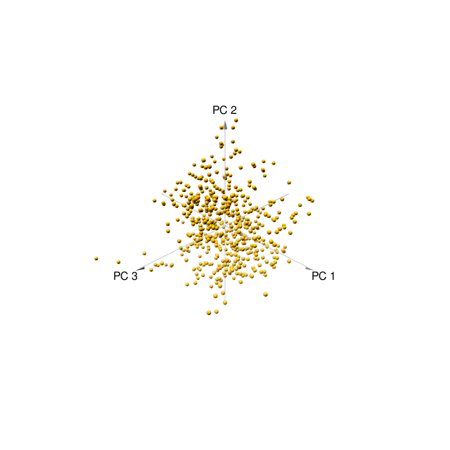

```{r setup, include=FALSE, echo=FALSE}
if(!require(dplyr)) install.packages("dplyr",repos = "http://cran.us.r-project.org", dependencies = T)
if(!require(readxl)) install.packages("readxl",repos = "http://cran.us.r-project.org", dependencies = T)
if(!require(ggplot2)) install.packages("ggplot2",repos = "http://cran.us.r-project.org", dependencies = T)
if(!require(car)) install.packages("car",repos = "http://cran.us.r-project.org", dependencies = T)
if(!require(vegan)) install.packages("vegan",repos = "http://cran.us.r-project.org", dependencies = T)
if(!require(pca3d)) install.packages("pca3d",repos = "http://cran.us.r-project.org", dependencies = T)
```

# Сделать описание датасета

```{r}
prot_expr <- 
  read_xls('~/Git_Repositories/BI_2019_Stats/Stat_project_3/Data_Cortex_Nuclear.xls')
```

Определим количество мышей с учётом знания того, что было взято 15 образцов:

```{r}
length(prot_expr$MouseID)/15
```


Взглянем на структуру данных и выделим группы. Кроме того, взглянем на баланс данны в группах:

```{r}
prot_expr_chars <- prot_expr %>% select_if(is.character)
apply(prot_expr_chars[,-1], MARGIN = 2, function(x) table(x))
```

В целом данные достаточно сбалансировано раскинуты по группам.

Определим количество полных наблюдений:

```{r}
nrow(prot_expr) - length(which(rowSums(is.na(prot_expr)) > 0))
```


Внесём числовые значения в отдельный датасет, уберём пропуски, так как усреднение по такому большому количеству данных может негативно сказаться на результатах анализа:

```{r}
prot_expr_omited <- na.omit(prot_expr)
prot_expr_chars <- prot_expr_omited[,-1] %>% select_if(is.character)
prot_expr_num <- prot_expr_omited %>% select_if(is.numeric)
```


# Есть ли различия в уровне продукции BDNF_N в зависимости от класса в эксперименте

Убедимся, что данная переменная распределена нормально:

```{r}
qplot(prot_expr_omited$BDNF_N, geom = 'histogram')
```


Так как данные распределены нормально, смело используем ANOVA для проверки на различия:

```{r}
fit <- aov(BDNF_N ~ class, prot_expr_omited)
summary(fit)
```

```{r}
ggplot(prot_expr_omited, aes(x = class, y = BDNF_N, fill = class)) +
    geom_boxplot() 
```


Различия действительно есть.
Для выявления конкретных различий используем парный Т тест с поправкой Бонферрони:

```{r}
pairwise.t.test(prot_expr_omited$BDNF_N, prot_expr_omited$class, p.adjust.method = 'bonferroni')
```


# Попробовать построить линейную модель, способную предсказать уровень продукции белка ERBB4_N на основании данных о других белках в эксперименте

Подберём оптимальную модель с помощью функции step:

```{r, results='hide'}
model_full <- lm(ERBB4_N ~ ., prot_expr_num)
model_null <- lm(ERBB4_N ~ 1, prot_expr_num)
optimal_model <- step(model_full, scope = list(lower = model_null, upper = model_full))
```

```{r}
summary(optimal_model)
```

## Диагностика модели

### Проверка графиков остатков

```{r}
mod_diag <- fortify(optimal_model)
gg_resid <- ggplot(data = mod_diag, aes(x = .fitted, y = .stdresid)) + 
  geom_point() + 
  geom_hline(yintercept = 0) +
  geom_smooth(method = "lm") +
  geom_hline(yintercept = 2, color = "red") +
  geom_hline(yintercept = -2, color = "red")

gg_resid
```

Сделаем определенные выводы:

* Модель обладает определенной линейностью взаимосвязи
* Относительно много наблюдений находятся за пределеами зоны +- 2 стандартных отклонения
* Гетероскедастичность отсутствует

Неплохо, но довольно сильные отклонения за пределы доверительного интервала смущают.

### Проверка на выбросы

Для начала, подберём маржу, выход за границу которой будем считать выбросом.


```{r}
metric <- 4/nrow(prot_expr_omited)
```

```{r}
ggplot(mod_diag, aes(x = 1:nrow(mod_diag), y = .cooksd)) + 
  geom_bar(stat = "identity") + 
  geom_hline(yintercept = metric, color = "red")
```

Обнаружим выбросы


### Проверка на наличие независимых наблюдений

```{r}
durbinWatsonTest(optimal_model)
```

Значение статистики автокорреляции значительно меньше двух. P value так и вовсе стремится к нулю. Таким образом, автокорреляция определенно присутствует.


Таким образом, полученная модель не идеальная, но в целом с ней работать можно.

# Сделайте PCA

Проведём ординацию и определим вклад каждой из компонент в изменчивость:

```{r}
prot_expr_pca <- rda(prot_expr_num, scale = TRUE)
summary(prot_expr_pca)

```


Так как первые две компоненты объясняют более всего изменчивости, построим биплот для них:

```{r}
biplot(prot_expr_pca, scaling = "species", display = "species")
```

Посчитаем процент, который объясняет каждая из компонент:

```{r}
pca_summary <- prcomp(prot_expr_num, scale= T)
eigs <- pca_summary$sdev^2
eigs/sum(eigs)*100
```


Построим 3д график для первых трёх PC:

```{r}
pca3d(pca_summary)
snapshotPCA3d(file="first_plot.png")
```





